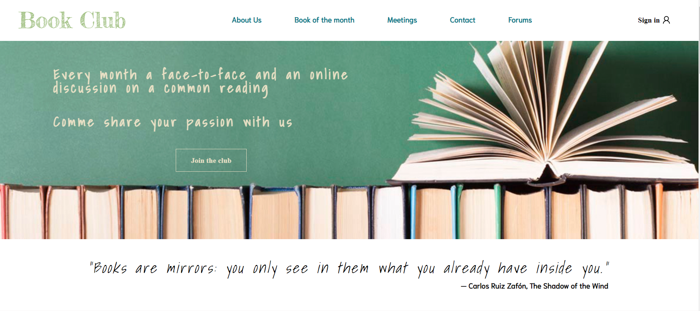

  <h1>📕 Bookclub</h1>
  <strong>Codecademy Challenge Project: Responsive Club Website</strong> 

 

## Table of contents

- [Overview](#overview)
  - [The challenge](#the-challenge)
  - [Screenshot](#screenshot)
  - [Links](#links)
- [My process](#my-process)
  - [Built with](#built-with)
- [Author](#author)

## Overview

### The challenge

In this project, you’ll be building your own club group page that will dynamically respond as you adjust the size of your screen!​

### Screenshot

### Links

- [Git hub code](https://github.com/marianarainha/bookclub)
- [Git hub live page](https://marianarainha.github.io/bookclub/)

## My process

### Built with

- Semantic HTML5 markup
- Flexbox
- Media queries

## Author

- Website - [Github](https://github.com/marianarainha)
